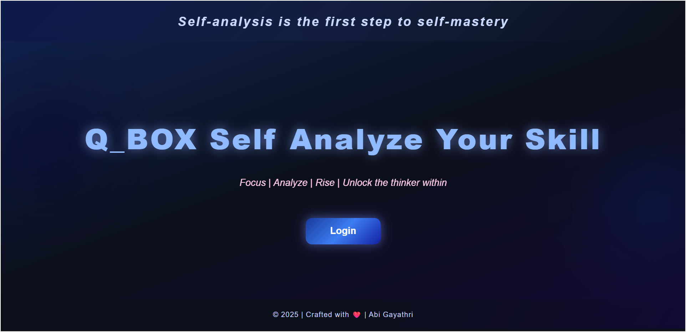
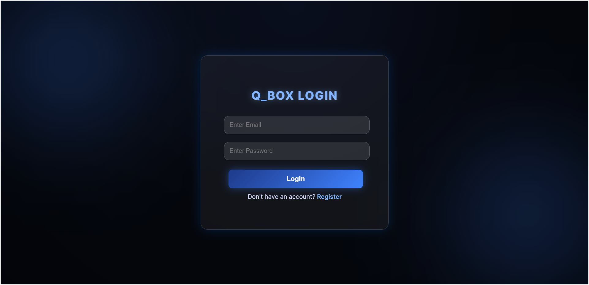
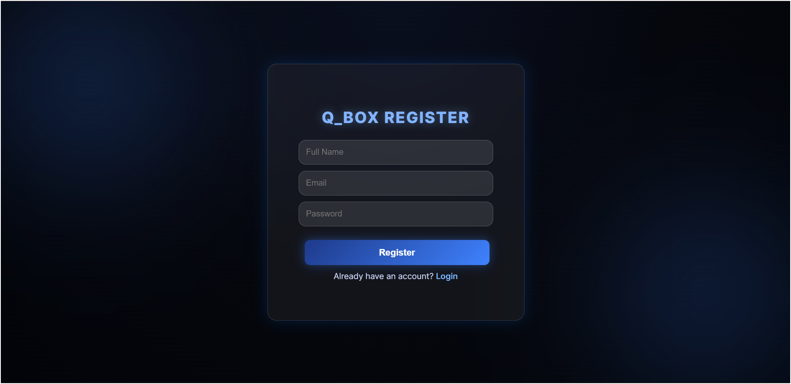
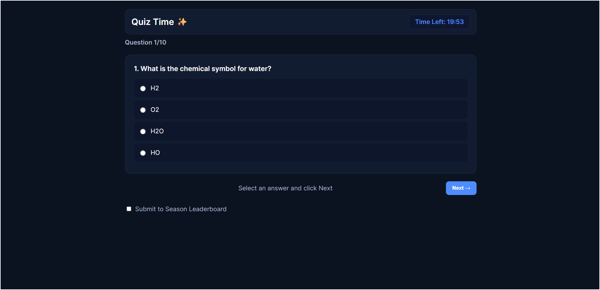
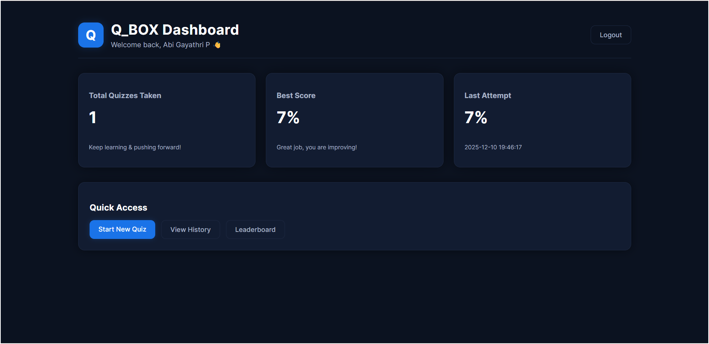
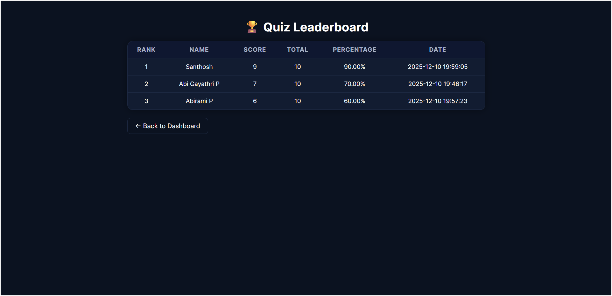
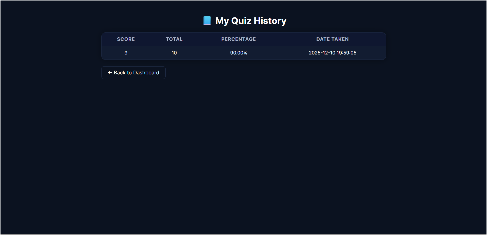

# QBox - Online Quiz Web Application

QBox is a professional, modern online quiz platform with real-time scoring, leaderboards, and a sleek dark Blue & Pink UI. Built with PHP 8, MySQL, and vanilla JavaScript, it features role-based access (user/admin), quiz timers, transactional result storage, and DB-backed statistics.

## 🎯 Overview

**QBox** is a comprehensive quiz engine that powers interactive assessments with:
- **10-question per-quiz** format with one-by-one navigation
- **Real-time timer** (20 minutes) with auto-submit
- **Per-question answer tracking** in the database
- **Global leaderboards** with seasonal rankings
- **Admin CSV upload** for bulk quiz management
- **Responsive design** (dark Blue & Pink theme) with mobile support
- **Security-first**: Prepared statements, CSRF tokens, session-based auth

---

## 🛠️ Technical Stack

| Layer | Technology |
|-------|-----------|
| **Frontend** | HTML5, CSS3 (design tokens, glassmorphism, dark theme), Vanilla JavaScript |
| **Backend** | PHP 8 (OOP-style, prepared statements, transactions) |
| **Database** | MySQL 5.7+ / MariaDB (optimized queries, window functions) |
| **Server** | Apache 2.4+ (XAMPP-compatible) |
| **Session Management** | PHP sessions (future: JWT support) |
| **Additional** | CSV upload/parsing, prepared statements, transactional saves |

---

## ✨ Key Features

### 👤 User Features
- **Registration & Login**: Secure with hashed passwords and prepared statements
- **Quiz Engine**: 
  - 10 random questions per attempt
  - One-by-one navigation with validation (must select answer before Next)
  - Real-time countdown timer (auto-submit on expiry)
  - Per-question tracking of answers and correctness
- **Results & Scoring**: Immediate score calculation and percentage display
- **History**: Full attempt history with date, score, and review
- **Dashboard**: User stats (total attempts, best score, last attempt flash)
- **Leaderboard**: Global all-time, seasonal, and quiz-specific rankings
- **Season Submission**: Optional opt-in to competitive leaderboards

### 👨‍💼 Admin Features
- **Admin Dashboard**: Overview of platform metrics
- **CSV Quiz Upload**: Bulk import questions (format: question, optionA, optionB, optionC, optionD, correctAnswer)
- **User Management**: View and manage registered users
- **Quiz History**: View all user attempts across quizzes
- **Leaderboard Moderation**: View and manage rankings

### 🎨 UI/UX Features
- **Dark Blue & Pink Theme**: Professional gradient design with accessibility focus
- **Responsive Layout**: Mobile-first, works on all screen sizes
- **Glassmorphism Cards**: Modern frosted-glass effect for visual hierarchy
- **Progress Indicators**: Question progress (X/10), timer, navigation hints
- **Toast/Flash Messages**: Immediate feedback on actions
- **Badge System**: Top 3 leaderboard badges (gold/silver/bronze ready)

---

## 📁 Project Structure

```
QBox/
├── index.php                    # Login page (entry point)
├── Home.php                     # Landing page with platform overview
├── register.php                 # User registration
├── logout.php                   # Session logout
│
├── config/
│   └── db.php                   # MySQL connection (mysqli)
│
├── assets/
│   ├── css/
│   │   └── style.css            # Global design tokens, components, dark theme
│   ├── js/
│   │   └── script.js            # Shared JavaScript utilities
│   └── Screenshot/              # Screenshots for documentation
│       ├── home.png             # Landing page
│       ├── login.png            # Login interface
│       ├── register.png         # Registration form
│       ├── quiz.png             # Quiz interface (one-by-one)
│       ├── dashboard.png        # User dashboard
│       ├── leaderboard.png      # Global leaderboard
│       └── history.png          # Quiz history/review
│
├── user/
│   ├── dashboard.php            # User stats & quick actions
│   ├── quiz.php                 # Quiz engine (10 Qs, timer, navigation)
│   ├── result.php               # Result review & analysis
│   ├── history.php              # Full attempt history
│   └── leaderboard.php          # Global & seasonal rankings
│
├── admin/
│   ├── dashboard.php            # Admin overview
│   ├── upload_quiz.php          # CSV upload for bulk questions
│   ├── history.php              # All users' attempt history
│   └── manage_users.php         # User administration
│
├── DB/
│   └── qbox_db.sql              # Database schema (tables, constraints, sample data)
│
├── csv/
│   └── sample_questions.csv     # Example CSV for quiz import
│
└── README.md                    # This file
```

---

## 🗄️ Database Schema (Key Tables)

### `users`
```
id, name, email (UNIQUE), password (hashed), role (user|admin), is_active, created_at
```

### `quizzes`
```
id, title, description, total_questions, created_at
```

### `questions`
```
id, quiz_id, question, option_a, option_b, option_c, option_d, correct_option (A|B|C|D), created_at
```

### `user_results` (Transactional)
```
id, user_id, quiz_id, score, total_questions, percentage, created_at
```

### `user_answers` (Per-question tracking)
```
id, result_id, question_id, selected_option (A|B|C|D|NULL), is_correct (0|1), created_at
```

### `season_leaderboard` (Optional precompute)
```
id, user_id, season_id, quiz_id, result_id, score, total_questions, percentage, submitted_at
```

---

## 🚀 Quick Start

### Prerequisites
- XAMPP (Apache + MySQL + PHP 8.0+)
- MySQL 5.7+ or MariaDB

### Setup Steps

1. **Extract** the repository into `C:\xampp\htdocs\QBox\`

2. **Import Database**:
   - Open phpMyAdmin: `http://localhost/phpmyadmin`
   - Create database: `QBox_db`
   - Import `DB/qbox_db.sql`

3. **Configure Database** (if needed):
   - Edit `config/db.php` with your credentials

4. **Start XAMPP**:
   - Start Apache & MySQL services

5. **Access Application**:
   - **User**: `http://localhost/QBox/` or `http://localhost/QBox/Home.php`
   - **Admin**: Log in with admin credentials from DB

### Test Credentials (from seed data)
- **User**: `user@example.com` / `password123`
- **Admin**: `admin@example.com` / `admin123`

---

## 📖 Usage Guide

### For Users
1. **Register** at `/register.php`
2. **Login** at `/index.php`
3. **Take Quiz**: 
   - Click "Start Quiz" on dashboard
   - Navigate questions one-by-one (must select answer before Next)
   - Timer counts down; auto-submits at 0:00
   - View score immediately on redirect to dashboard
4. **View History** at `/user/history.php`
5. **Check Rankings** at `/user/leaderboard.php`

### For Admins
1. **Login** with admin credentials
2. **Upload Questions** at `/admin/upload_quiz.php`:
   - Use CSV format: `question, optionA, optionB, optionC, optionD, correctAnswer`
   - Example: `What is 2+2?, 3, 4, 5, 6, B`
3. **View All Attempts** at `/admin/history.php`
4. **Manage Users** at `/admin/manage_users.php`

---

## 🎨 Design System

### Color Tokens (Dark Blue & Pink Theme)
```css
--bg: #0b1220;                   /* Deep navy background */
--card: #121c31;                 /* Card container */
--border: #1d2942;               /* Subtle borders */
--text: #ffffff;                 /* Primary text */
--muted: #a8b3c7;                /* Secondary text */
--primary: #4f8cff;              /* Blue accent */
--hover: #2a4c99;                /* Hover state */
```

### Components
- **Buttons**: `.btn`, `.btn-primary` (rounded, hover effects)
- **Cards**: `.card` (glassmorphism, shadow)
- **Container**: `.container` (max-width 900px, centered)
- **Grid**: `.grid-2` (2-column layout, responsive)

---

## 🔒 Security Features

- **Prepared Statements**: All DB queries use parameterized statements (no SQL injection)
- **Password Hashing**: `password_hash()` with BCRYPT algorithm
- **Session Management**: PHP `$_SESSION` with CSRF tokens on forms
- **Quiz Token**: One-time CSRF token per quiz attempt
- **Input Validation**: Sanitize and validate all user inputs
- **Transactional Saves**: Results & answers saved in single transaction (all-or-nothing)

---

## 🎯 Architecture Highlights

### Quiz Flow (Server-Side)
1. **Load Quiz**: Fetch 10 random questions, generate CSRF token, store Q IDs in session
2. **User Submits**: Validate token, calculate score, check correctness per question
3. **Save Result**: Insert into `user_results` + per-question rows in `user_answers` (transaction)
4. **Redirect**: Back to dashboard with session flash (score, percentage)

### Client-Side (JS)
- One-by-one question display (hidden/visible toggle)
- Timer countdown with auto-submit on expiry
- Form validation (must select before Next)
- Hidden submit marker to prevent double-submit

### Leaderboard Query (SQL Window Function)
```sql
SELECT DISTINCT ON (user_id) ... ORDER BY user_id, percentage DESC
-- Returns best score per user, ranked globally
```

---

## 📊 Screenshots

### 🏠 Home Page


### 🔑 Login


### 📝 Register


### 📝 Quiz Interface (One-by-One)


### 📊 User Dashboard


### 🏆 Leaderboard


### 📜 History / Review


---

## 🔧 Configuration

### Quiz Settings
- **Questions per quiz**: 10 (configurable in `user/quiz.php` line 108)
- **Time limit**: 20 minutes (1200 seconds, configurable line 12)
- **Season ID**: Hardcoded to 1 (can extend for multiple seasons)

### Database Settings
Edit `config/db.php` for custom credentials:
```php
$host = "localhost";
$user = "root";
$password = "";
$dbname = "QBox_db";
```

---

## 📈 Future Enhancements

- [ ] **JWT Authentication**: Stateless API for mobile apps
- [ ] **AI Difficulty Engine**: Adaptive question selection based on performance
- [ ] **PDF Export**: Generate result certificates
- [ ] **Analytics Dashboard**: Charts, trends, user insights
- [ ] **Proctoring/Anti-Cheat**: Telemetry, screenshot detection
- [ ] **Multi-language Support**: i18n for global reach
- [ ] **Mobile App**: React Native or Flutter wrapper
- [ ] **WebSocket Live Updates**: Real-time leaderboard
- [ ] **Question Bank Management**: UI for admin question CRUD

---

## 🤝 Contributing

To contribute:
1. Create a feature branch: `git checkout -b feature/your-feature`
2. Commit changes: `git commit -m "Add your feature"`
3. Push to branch: `git push origin feature/your-feature`
4. Open a pull request

---

## 📝 License

This project is open source and available under the MIT License.

---

**Last Updated**: December 10, 2025  
**Version**: 1.0.0
